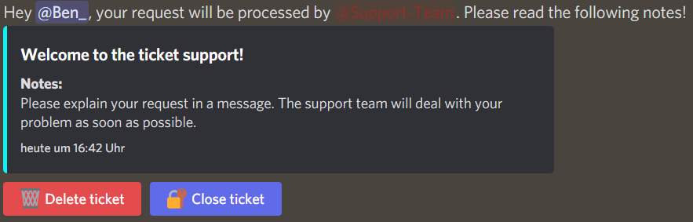
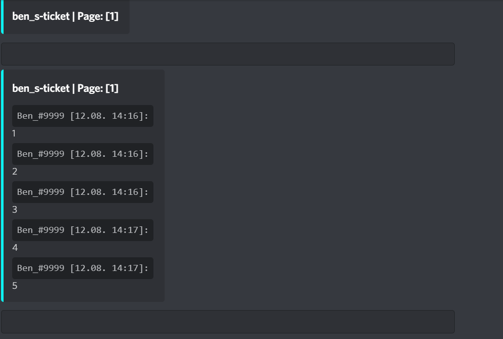

# Discord Bot Ticket-System

> A simple ticket system for your Discord bot.
> If you have any errors or concerns, please write to me via Discord: Ben_ # 9999

## How to use the Code:

1. Download the zip file from GitHub and unzip it.
2. Check whether your version in README.md matches the [current version](https://github.com/Ben4oo/discord-ticketsystem/blob/main/README.md#version), otherwise download the latest version.
3. Open the file `TicketBot.ini` and adjust **ALL** values in the **[Config]** section.   
4. Execute the file `mainbuildergamesbot.py`: *Debian:* `python3 mainbuildergamesbot.py & `
6. I would recommend always checking that your version is up to date! ([current version](https://github.com/Ben4oo/discord-ticketsystem/blob/main/README.md#version))

## Preview:

This is what the message looks like in the ticket:

This is what a message looks like in the ticket archive:

## Version:
V 1.0.0
